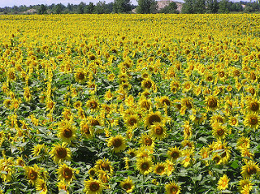
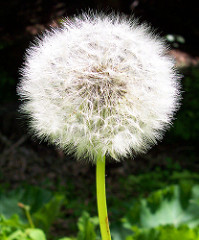
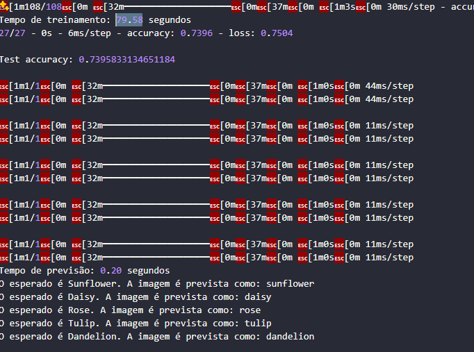
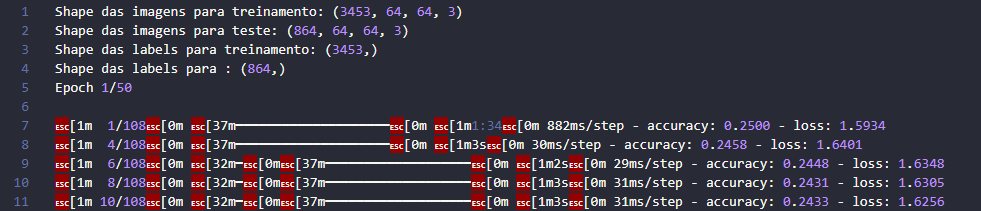
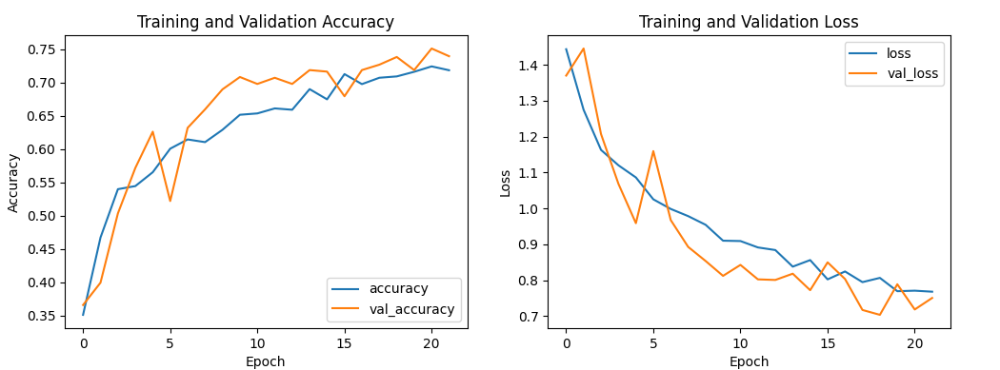
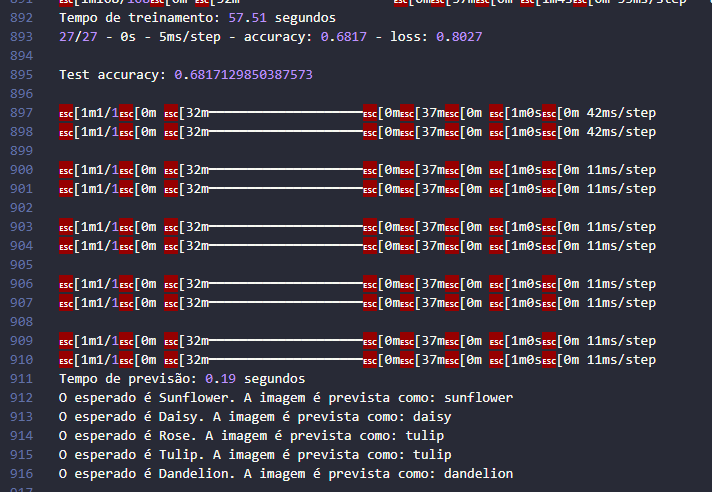
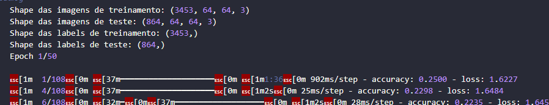
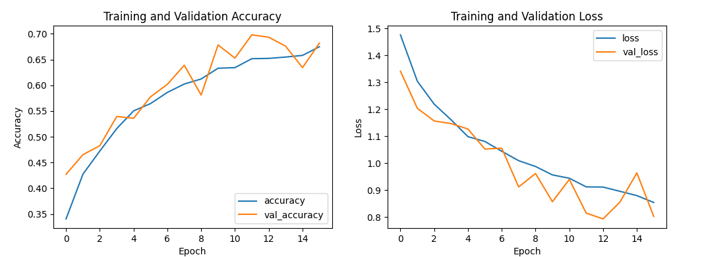

# Classificação de Imagens de Flores com CNN 🌼🌷🌹🌻

## Integrantes
- Gabriela Giolo - 1129816
- Guilherme Camargo - 1130372
- Júlia Parizotto - 1127825
- Mathias Diehl -  1130078

## Descrição do Projeto 📚

Este projeto tem como objetivo desenvolver uma rede neural convolucional (CNN) para classificar imagens de flores em cinco categorias ([dataset usado](https://www.kaggle.com/datasets/alxmamaev/flowers-recognition)): girassol, margarida, rosa, tulipa e dente-de-leão. O projeto utiliza técnicas de data augmentation e regularização para melhorar a precisão do modelo e evitar overfitting. Além disso, a execução do treinamento pode ser feita tanto em CPU quanto em GPU, dependendo da configuração do ambiente.

## O que é Machine Learning? 🤖

Machine learning (aprendizado de máquina) é um campo da inteligência artificial que permite que sistemas aprendam e façam previsões ou decisões com base em dados. Em vez de serem explicitamente programados para realizar uma tarefa, os modelos de machine learning usam algoritmos para identificar padrões e inferir regras a partir dos dados fornecidos.

## Tecnologias Utilizadas 💻

- Python
- TensorFlow e Keras para construção e treinamento do modelo
- scikit-learn para pré-processamento dos dados
- Matplotlib para visualização dos resultados
- ImageDataGenerator para data augmentation

## Como Rodar ✅

### Pré-requisitos

- Python 3.x
- TensorFlow (com suporte a GPU, se aplicável)
- CUDA e cuDNN (para execução em GPU)
- Bibliotecas adicionais: `matplotlib`, `numpy`, `scikit-learn`

### Instalação

1. Clone o repositório:
```bash
git clone https://github.com/seu-usuario/seu-repositorio.git
cd seu-repositorio
```
2. Instale as dependências:
```bash
pip install tensorflow keras matplotlib numpy scikit-learn
```

## Executando o Projeto 🍀

Para ambas as execuções, um arquivo output.log será gerado com informações da execução, shape das imagens e labels e resultado das previsões de teste

### Executando com CPU

Abra o arquivo de código `main.py` e defina a variável `run_with_gpu` como `False` (se já não estiver):

Execute o script:

```bash
python main.py
```

### Executando com GPU

Abra o arquivo de código `main.py` e defina a variável `run_with_gpu` como `True` (se já não estiver):

Certifique-se de que o TensorFlow com suporte a GPU está instalado e configurado corretamente no seu ambiente.

Execute o script:

```bash
python main.py
```

## Teste Prático
Você pode testar o modelo usando novas imagens de flores. Certifique-se de que as imagens estão redimensionadas para 64x64 pixels e normalizadas. A função load_and_preprocess_image pode ser usada para carregar e pré-processar as imagens antes de fazer a previsão com o modelo.

```python
# Carregar e pré-processar a imagem de teste
image_path = 'caminho/para/sua/imagem.jpg'
test_image = load_and_preprocess_image(image_path)

# Fazer a previsão
with tf.device(device):
    prediction = model.predict(test_image)

# Obter a classe prevista
predicted_class = label_encoder.classes_[np.argmax(prediction)]
print(f'A imagem foi classificada como: {predicted_class}')
```

## Exemplos 📜

- Imagens utilizadas em ambos os testes:






### Execução com CPU
- Print do arquivo `output.log` com resultados da previsão e shape dos dados:
- Previsão:


- Shapes:


- Gráficos (explicação abaixo)


- Tempo de execução:
Treinamento: 79.58 segundos
Previsão: 0.20 segundos

### Execução com GPU
- Print do arquivo `output.log` com resultados da previsão e shape dos dados:

- Previsão:


- Shapes:


- Gráficos (explicação abaixo)


- Tempo de execução:
Treinamento: 57.51 segundos
Previsão: 0.19 segundos

## Análise dos Gráficos de Acurácia e Perda 📈

### Gráfico de Acurácia de Treinamento e Validação

O gráfico à esquerda mostra as curvas de acurácia para o conjunto de treinamento e o conjunto de validação ao longo das épocas de treinamento.

- **Curva Azul (accuracy)**: Representa a acurácia do modelo no conjunto de treinamento. A acurácia é a proporção de previsões corretas feitas pelo modelo em relação ao total de previsões.
  
- **Curva Laranja (val_accuracy)**: Representa a acurácia do modelo no conjunto de validação. O conjunto de validação é usado para verificar como o modelo está generalizando para novos dados não vistos durante o treinamento.

### Gráfico de Perda de Treinamento e Validação

O gráfico à direita mostra as curvas de perda para o conjunto de treinamento e o conjunto de validação ao longo das épocas de treinamento.

- **Curva Azul (loss)**: Representa a perda do modelo no conjunto de treinamento. A perda é uma medida de quão bem o modelo está se ajustando aos dados de treinamento; uma perda menor indica um ajuste melhor.
  
- **Curva Laranja (val_loss)**: Representa a perda do modelo no conjunto de validação. A perda de validação indica quão bem o modelo está se generalizando para novos dados.
